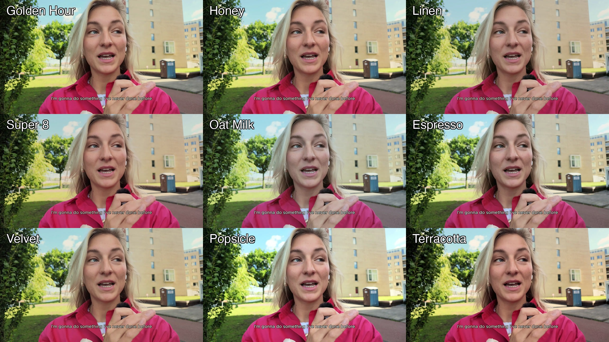

# 🖍️ color-correct

**An AI colorist skill for Claude Code** — your agent looks at your footage, diagnoses it, grades it, and shows you a before/after before rendering. Nine named looks reverse-engineered from creators with great color. ffmpeg-based, non-destructive.


## What it does

- **Pick a look** — *"apply Oat Milk to this clip"*
- **See the menu** — *"show me all the looks on this video"* → labeled 3×3 contact sheet on your own footage
- **Let AI decide** — *"make this look good"* → it diagnoses (talking head vs b-roll vs screen recording), fixes casts/exposure first, picks a fitting look, and shows a side-by-side before committing
- **Steal any look** — *"make my footage look like [creator]"* → consensus fingerprinting across multiple videos separates the *grade* from the *scenery*

## The nine looks



| Look | Character |
|---|---|
| **Golden Hour** | filmic warmth, rolled-off whites |
| **Honey** | soft warm matte |
| **Linen** | quiet Scandi softness |
| **Super 8** | film-stock compression |
| **Oat Milk** | creamy editorial (warm shadows → cool milky highlights) |
| **Espresso** | dark & moody, warm skin |
| **Velvet** | lifted matte blacks |
| **Popsicle** | bright sunny pop |
| **Terracotta** | warm, contrasty, rich |

Every look ships at **subtle strength by default** — graded footage should look *shot well*, not *filtered*.

## 🧊 LUTs included — use the looks anywhere

Every look also ships as a standard **.cube 3D LUT** (36³), so you can use them without an agent — in **Premiere, DaVinci Resolve, Final Cut, CapCut**, or straight ffmpeg:

```
luts/subtle/   ← the shipping strength (start here)
luts/full/     ← full consensus strength (flat footage / "more")
```

```bash
ffmpeg -i in.mp4 -vf "lut3d=luts/subtle/golden-hour.cube" -c:a copy out.mp4
```

LUTs are generated from the exact same chains via `scripts/gen_luts.sh` (HALD-CLUT method, verified to match within ~1/255).

## How the looks were made

Not vibes — measurement. For each reference creator we sampled **~18 frames across 3 different videos** (different scenes, lighting, even climates), computed a per-frame grade fingerprint (luma percentiles, per-tonal-band color casts, saturation), and took the **median + IQR**. Tight IQR across all scenes = the actual grade; wide IQR = scenery, discarded.

The single-frame version of this gets it wrong in fascinating ways — one creator's "cool daylight look" turned out to be a blue sky, and their actual grade was warm. The consensus method (and that story) is documented in [SKILL.md](SKILL.md).

Looks studied from creators we admire: [Elias & Kajsa](https://www.youtube.com/@eliasandkajsa), [Benji Plant](https://www.youtube.com/@benjiplant), [Jonna Jinton](https://www.youtube.com/@jonnajinton), [Meek Surf](https://www.youtube.com/@MeekSurf), [Radhi Devlukia](https://www.youtube.com/watch?v=mL3WBL1P0qY), [Bryan Johnson](https://www.youtube.com/@BryanJohnson), [Enrico Tartarotti](https://www.youtube.com/@enricotartarotti), [David Dobrik](https://www.youtube.com/@DavidDobrik), [Paige Wassel](https://www.youtube.com/@wasselpa). 💛 These are *interpretations* of their color character, derived from published videos — go watch them.

## Install

```bash
git clone https://github.com/louisedesadeleer/color-correct.git
```

Then point your agent at it. In Claude Code, add to your `CLAUDE.md`:

```markdown
#### /color-correct
Read: /path/to/color-correct/SKILL.md
Grade a video with Claude as the colorist — pick a named look, see the menu, or let AI decide.
```

**Requirements:** `ffmpeg`, `python3` + Pillow/numpy (`pip install pillow numpy`), `yt-dlp` (only for Steal mode).

## Usage

```
/color-correct path/to/video.mp4                     → AI decides
/color-correct path/to/video.mp4 apply Golden Hour   → one look
/color-correct path/to/video.mp4 menu                → 3×3 sheet of all looks on your frame
/color-correct video.mp4 --like <youtube-url>        → steal a new look
```

## LUTs + agent: who does what

**The LUTs are the deliverable. The agent is the colorist.** They're layers, not rivals:

- A **LUT** is fixed math — maximum compatibility, same result everywhere. Perfect for *distributing a look* into any tool.
- But a LUT **can't correct**: apply Golden Hour to footage with a green webcam cast and you get a beautifully graded green cast. White balance and exposure are footage-dependent by definition — no file can contain that decision.
- The **agent** does everything a file can't: looks at *your* footage, fixes casts and exposure first, picks a look that fits the content, adapts the strength when a look fights your lighting, skips the screen-recording b-roll, and re-measures after grading to verify the numbers moved where predicted.

Use the LUTs alone and you get the looks. Use the agent and you get a colorist who happens to carry LUTs in their pocket.

---

Built by [Louise de Sadeleer](https://www.linkedin.com/in/louisedesadeleer/) with Claude. Part of a series of AI video-editing skills.
